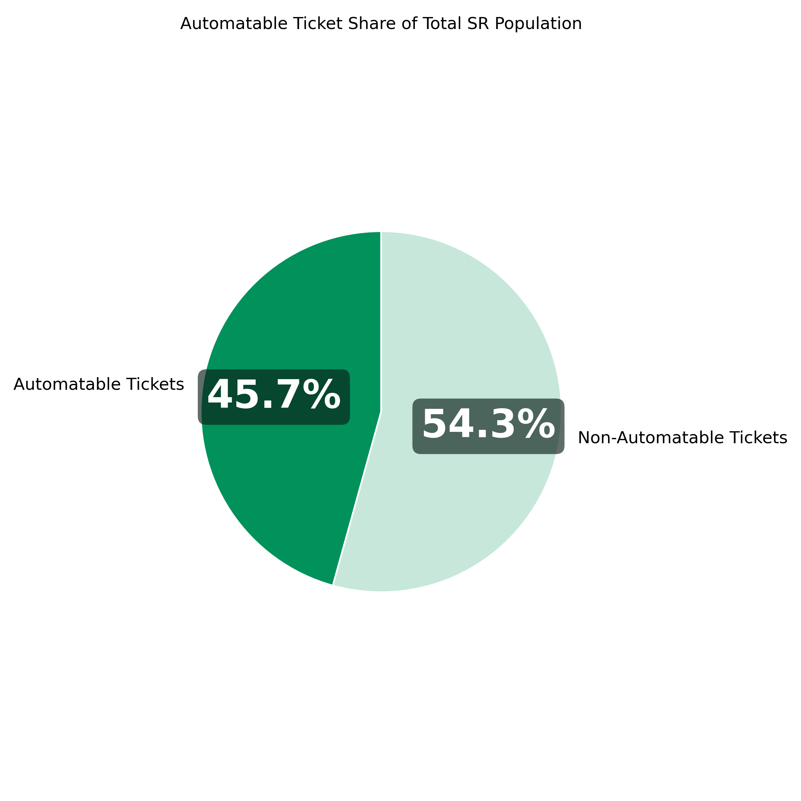
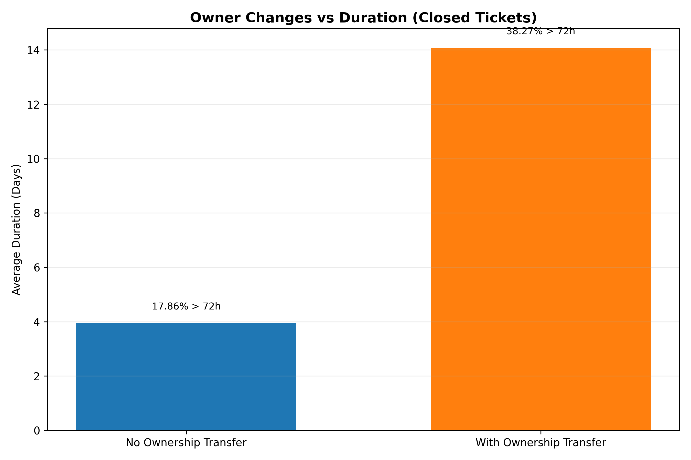
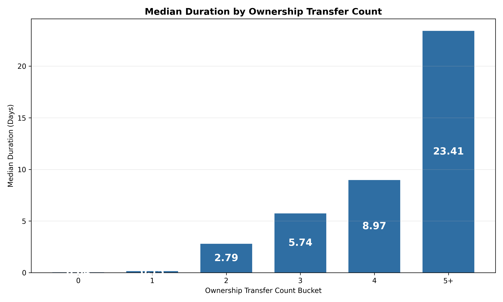
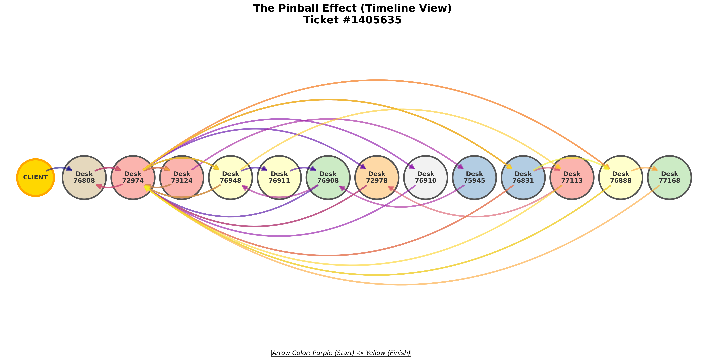
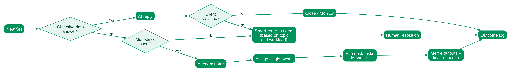

# BNP Paribas Securities Services - Hobart Case

## Final Executive Deliverable

## 1. Executive Message

Hobart has three main optimizable axes:

1. **Automatable tickets**: a large share of requests are simple and directly answerable from internal data.
2. **Ownership transfer tax**: tickets are often sent to the wrong known contact first, then reassigned internally.
3. **Boomerang effect in complex flows**: tickets move back and forth and do not follow the most efficient path.

---

## 2. Issue 1 - Automatable Ticket Pool (Simple, Direct Data Requests)

## What we observed

A very large ticket share is objective and can be answered from trusted internal data without subjective interpretation.

## Automatable ticket criteria (clear rule set)

A ticket is classified as automatable only if **all** conditions below are true:

1. `transfer_count <= 1`
2. `comm_count <= 1`
3. `task_count <= 1`
4. `reopen_date_parsed IS NULL`
5. The request is objective and can be answered from trusted internal data (no subjective interpretation)

Scope note for measurement rigor:

- The analysis population is **closed tickets only** (open/in-progress tickets excluded) to avoid underestimating duration.

Why this matters:

- It keeps AI focused on low-risk, factual requests.
- It excludes unstable cases that already show escalation signals.
- It preserves service quality by pushing ambiguous cases to humans.

## Evidence

- Total tickets analyzed: **4,729,176**
- Automatable tickets: **2,160,544**
- Automatable share: **45.69%**
- Median handling proxy on this pool: **0.93 hours**

Management interpretation:

- Even if each ticket is relatively fast, the volume is so high that this still consumes substantial team capacity.

---

## 3. Issue 2 - Ownership Transfer Tax (Wrong Initial Contact)

## What we observed

The operational pattern is often:

- client sends to a customer service email they already know,
- but that person is not the best owner for this ticket,
- ticket gets reassigned one or multiple times.

This reassignment chain is a major time tax.

## Evidence

- Median duration **without** ownership transfer: **0.036 days**
- Median duration **with** ownership transfer: **1.064 days**
- Average duration with ownership transfer: **14.08 days**
- Average duration without ownership transfer: **3.95 days**
- Ratio (with/without): **3.56x**

Management interpretation:

- The key penalty is not only complexity of work, but ownership instability and reassignment delay.

---

## 4. Issue 3 - Boomerang Effect (Back-and-Forth, Non-Optimal Path)

## What we observed

In multi-step tickets, there is frequent back-and-forth (ping-pong), and some tickets revisit desks already seen (loop behavior), which means the path is not optimal.

## Evidence

- Average hops per ticket: **1.32**
- Loop rate on transferred tickets: **17.88%**
- Tickets with 5+ transfers: **0.92%** (small segment, very high friction)

Management interpretation:

- A notable part of complex workload is lost to coordination inefficiency, not value-adding resolution steps.

---

## 5. Solution (Theoretical Operating Model)

Decision tree used in operations

## Routing logic

1. **Is answer directly available with no subjective interpretation?**

- Yes -> AI response using internal database.
- If client responds `NOT RESOLVED` -> immediate handoff to human owner.

2. **If no direct answer, does it require multiple desks?**

- No -> assign best-fit human agent (specialty + live load + queue risk).
- Yes -> AI coordinator creates desk sequence; one human owner remains accountable end-to-end.

This is AI augmentation, not AI replacement.

---

## 6. Solution (Practical Implementation Built)

## A. MVP Data Layer

- Includes clients, trades, tickets, routing traces, desk plans/hops, assignments, messages.

## B. AI Routing Service

- Implemented: intent classification, deterministic decision-tree routing, direct-data responses, smart owner assignment, multi-desk planning, escalation handling.

## C. Email-to-Ticket Flow

- MailSlurp worker integrated for inbound/outbound processing.
- New email -> routing decision -> ticket trace -> response.

## D. Read-Only Management Dashboard

- `solution/management_dashboard/`
- Live overview + drilldown: ticket status, exchange, current desk, owner, routing trace, desk hops.

---

## 7. Why This Solution Fixes Each Issue

| Issue                  | Root cause                                                          | Solution mechanism                                                      | Expected outcome                                           |
| ---------------------- | ------------------------------------------------------------------- | ----------------------------------------------------------------------- | ---------------------------------------------------------- |
| Automatable pool       | High volume of objective requests                                   | AI direct response from trusted internal data                           | Lower manual load, faster first response                   |
| Ownership transfer tax | Client sends to familiar but wrong contact, then reassignment chain | Smart initial owner selection based on specialty/load + clear ownership | Fewer reassignments, shorter cycle time                    |
| Boomerang effect       | Back-and-forth and desk loops in complex tickets                    | AI workflow coordination + explicit desk plan + one accountable owner   | Fewer loops, cleaner path, better control of complex cases |

---

- Use dashboard in recurring management governance.

## 10. Final Takeaway

The analysis supports a clear conclusion:

- There is a large, measurable automatable ticket pool.
- Ownership reassignment is a major time tax (often starting from wrong initial contact).
- Complex ticket paths suffer back-and-forth inefficiency.

A hybrid AI + human-accountability operating model directly addresses these pain points and is already prototyped in a practical MVP.
