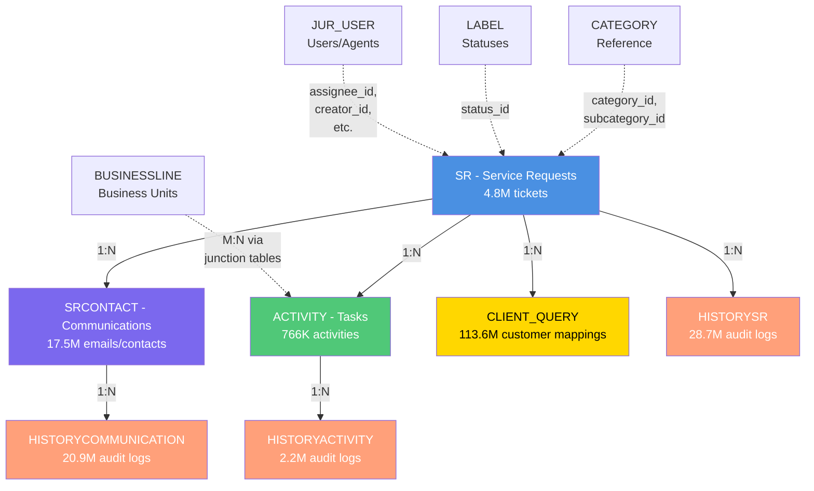
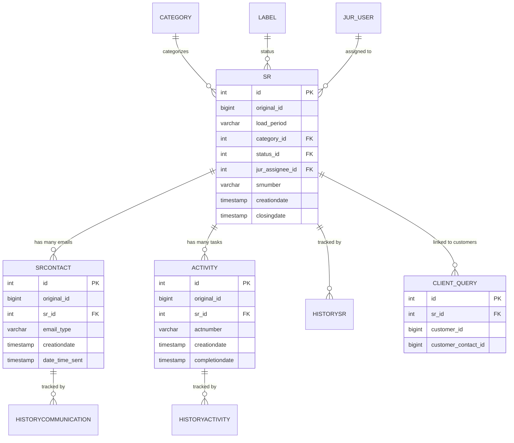

# Hobart Database - Complete Documentation

**Version:** 2.0  
**Last Updated:** February 13, 2026  
**Total Records:** ~188 million  
**Time Coverage:** January 2025 - January 2026

---

## 📊 **Database Overview**

The Hobart database is a comprehensive service request management system that tracks:
- **Customer Support Tickets** (Service Requests - SR)
- **Email Communications** (SRCONTACT)
- **Task Management** (ACTIVITY)
- **Customer Mapping** (CLIENT_QUERY)
- **Audit Trails** (HISTORY tables)

### Database Statistics

| Metric | Value |
|--------|-------|
| Total Tables | 15 |
| Total Rows | ~188 million |
| Database Size | ~14 GB |
| Time Periods | 3 (2025-01 to 2026-01) |
| Service Requests | 4,795,906 |
| Email Communications | 17,514,081 |
| Tasks/Activities | 765,632 |
| Customer-Ticket Mappings | 113,606,901 |
| Audit Log Entries | 51,735,297 |

---

## 🗺️ **Visual Relationship Schema**

### Main Entity Relationships



### Detailed Relationship Map



---

## 📋 **Table Descriptions**

---

## 1️⃣ **SR (Service Request)**

**Primary entity representing customer support tickets.**

### **Purpose**
Stores all service requests (tickets) submitted by customers. This is the central table that everything else links to.

### **Row Count:** 4,795,906

### **Key Columns**

| Column | Type | Description | Example |
|--------|------|-------------|---------|
| **id** | INTEGER | New auto-generated primary key | 1, 2, 3... |
| **original_id** | BIGINT | Original ID from CSV (preserved for reference) | 543210, 678901 |
| **load_period** | VARCHAR(20) | Which time period this record is from | "2025-01_to_2025-09" |
| **srnumber** | VARCHAR(255) | **Human-readable ticket ID** | "[ITAM1PT-MDM-16502]" |
| **category_id** | INTEGER | Foreign key to `category` table | 42 |
| **subcategory_id** | INTEGER | More specific category | 127 |
| **status_id** | INTEGER | Current ticket status (FK to `label`) | 5 (e.g., "Closed") |
| **jur_assignee_id** | INTEGER | Assigned agent/user (FK to `jur_user`) | 7152 |
| **creator_id** | INTEGER | Who created the ticket | 3891 |
| **priority_id** | BIGINT | Ticket priority level | 1 (High), 2 (Medium), 3 (Low) |
| **creationdate** | TIMESTAMP | When ticket was created | "2025-03-15 14:30:00" |
| **closingdate** | TIMESTAMP | When ticket was resolved | "2025-03-18 09:15:00" |
| **update_date** | TIMESTAMP | Last modification date | "2025-03-17 16:45:00" |
| **quick_answer** | SMALLINT | Is this a fast-track ticket? (0/1) | 1 |
| **internal_flag** | SMALLINT | Internal-only ticket? (0/1) | 0 |
| **alert** | SMALLINT | Has alert/escalation? (0/1) | 0 |

### **Foreign Key Relationships**
- `category_id` → `category.id` (ticket category)
- `subcategory_id` → `category.id` (more specific category)
- `status_id` → `label.id` (status: Open, Closed, Pending, etc.)
- `jur_assignee_id` → `jur_user.id` (assigned agent)
- `creator_id` → `jur_user.id` (ticket creator)
- `checkeruser_id` → `jur_user.id` (QA checker)
- `produceruser_id` → `jur_user.id` (producer/handler)

### **What This Table Contains**

```
Example row:
-----------------------------------------------------
id: 1
srnumber: [ITAM1PT-MDM-16502]
category: "Tax"
status: "Closed"  
assigned_to: "John Smith"
created: 2025-03-15 14:30:00
closed: 2025-03-18 09:15:00
-----------------------------------------------------
A tax-related IT service request, assigned to John Smith, 
created on March 15th and resolved in 3 days.
```

### **Top Categories**
1. Tax: 163,309 tickets
2. Cash instruction: 111,426 tickets
3. BAU Asset Creation: 90,342 tickets
4. CREST: 85,561 tickets
5. Others: 85,237 tickets

---

## 2️⃣ **SRCONTACT (Communications)**

**All email communications and contacts related to service requests.**

### **Purpose**
Tracks every email, message, or communication associated with a ticket. Multiple emails can be linked to one ticket.

### **Row Count:** 14,164,680

### **Key Columns**

| Column | Type | Description | Example |
|--------|------|-------------|---------|
| **id** | INTEGER | Primary key | 1 |
| **original_id** | BIGINT | Original CSV ID | 170162201 |
| **sr_id** | INTEGER | **Parent ticket** (FK to `sr.id`) | 42 |
| **email_type** | VARCHAR(30) | Type of communication | "Inbound", "Outbound" |
| **status** | VARCHAR(20) | Email status | "Sent", "Received", "Draft" |
| **importance** | VARCHAR(20) | Priority level | "Normal", "High", "Low" |
| **outbound** | SMALLINT | Is this an outgoing email? (0/1) | 1 |
| **has_attachment** | SMALLINT | Email has attachments? (0/1) | 1 |
| **is_read** | SMALLINT | Has been read? (0/1) | 1 |
| **is_draft** | SMALLINT | Still in draft? (0/1) | 0 |
| **creationdate** | TIMESTAMP | When email was created |"2025-03-15 15:00:00" |
| **date_time_sent** | TIMESTAMP | When email was sent | "2025-03-15 15:05:00" |
| **reception_date** | TIMESTAMP | When email was received | "2025-03-15 15:06:00" |
| **first_read_date** | TIMESTAMP | When first opened | "2025-03-15 16:30:00" |

### **Foreign Key Relationships**
- `sr_id` → `sr.id` (parent ticket)

### **What This Table Contains**

```
Example row:
-----------------------------------------------------
id: 1
sr_id: 42 (links to ticket [ITAM1PT-MDM-16502])
email_type: "Inbound"
status: "Received"
has_attachment: 1
created: 2025-03-15 15:00:00
sent: 2025-03-15 15:05:00
-----------------------------------------------------
An incoming email with an attachment, received at 3:05 PM 
on March 15th, linked to ticket #42.
```

### **Statistics**
- **60% of tickets** have at least one email
- **2.9 million tickets** with email communications
- Average: ~5 emails per ticket (for tickets with emails)

---

## 3️⃣ **ACTIVITY (Tasks)**

**Individual tasks and activities performed on tickets.**

### **Purpose**
Tracks formal tasks/activities assigned to handle a service request. A ticket can have multiple tasks (e.g., investigation, approval, implementation).

### **Row Count:** 382,816

### **Key Columns**

| Column | Type | Description | Example |
|--------|------|-------------|---------|
| **id** | INTEGER | Primary key | 1 |
| **original_id** | BIGINT | Original CSV ID | 1903801 |
| **sr_id** | INTEGER | **Parent ticket** (FK to `sr.id`) | 42 |
| **actnumber** | VARCHAR(100) | Activity reference number | "ACT-2025-001234" |
| **task_number** | BIGINT | Sequence number | 1, 2, 3 |
| **status_id** | BIGINT | Task status | 10 (e.g., "Complete") |
| **type_id** | BIGINT | Task type | 5 (e.g., "Investigation") |
| **jur_assigneduser_id** | BIGINT | Assigned to user | 7152 |
| **creationdate** | TIMESTAMP | Task created | "2025-03-15 14:45:00" |
| **completiondate** | TIMESTAMP | Task completed | "2025-03-16 10:30:00" |
| **notified** | SMALLINT | User notified? (0/1) | 1 |
| **is_draft** | SMALLINT | Still in draft? (0/1) | 0 |
| **is_accepted** | SMALLINT | Task accepted? (0/1) | 1 |

### **Foreign Key Relationships**
- `sr_id` → `sr.id` (parent ticket)

### **What This Table Contains**

```
Example row:
-----------------------------------------------------
id: 1
sr_id: 42 (links to ticket [ITAM1PT-MDM-16502])
actnumber: "ACT-2025-001234"
task_number: 1
status: "Complete"
assigned_to: "Jane Doe"
created: 2025-03-15 14:45:00
completed: 2025-03-16 10:30:00
-----------------------------------------------------
First task for ticket #42, assigned to Jane Doe, 
completed in under 24 hours.
```

### **Statistics**
- **6% of tickets** have formal tasks
- **272,130 tickets** with activity records
- Average: ~1.4 tasks per ticket (for tickets with tasks)

---

## 4️⃣ **HISTORYSR (SR Audit Trail)**

**Complete change history for service requests.**

### **Purpose**
Tracks every change made to a service request. Shows who changed what field, when, and what action was taken.

### **Row Count:** 28,650,010

### **Key Columns**

| Column | Type | Description | Example |
|--------|------|-------------|---------|
| **id** | INTEGER | Primary key | 1 |
| **sr_id** | INTEGER | **Parent ticket** (FK to `sr.id`) | 42 |
| **action** | VARCHAR(100) | What happened | "Create", "Update", "StatusChange" |
| **action_date** | TIMESTAMP | When change occurred | "2025-03-15 14:30:00" |
| **user_name** | VARCHAR(100) | Who made the change | "jsmith" |
| **field** | TEXT | Which field changed | "status", "assignee", "priority" |

### **Foreign Key Relationships**
- `sr_id` → `sr.id` (which ticket was changed)

### **What This Table Contains**

```
Example audit log entries for ticket #42:
-----------------------------------------------------
[2025-03-15 14:30:00] jsmith: Create (ticket created)
[2025-03-15 14:35:00] jsmith: Update field=priority
[2025-03-15 15:00:00] jdoe: Update field=assignee
[2025-03-18 09:15:00] jdoe: Update field=status
-----------------------------------------------------
Shows complete timeline of who did what to ticket #42.
```

---

## 5️⃣ **HISTORYACTIVITY (Activity Audit Trail)**

**Change history for tasks/activities.**

### **Purpose**
Tracks every change to activity/task records.

### **Row Count:** 2,193,932

### **Key Columns**

| Column | Type | Description |
|--------|------|-------------|
| **id** | INTEGER | Primary key |
| **activity_id** | INTEGER | **Parent activity** (FK to `activity.id`) |
| **action** | VARCHAR(100) | What happened |
| **action_date** | TIMESTAMP | When |
| **user_name** | VARCHAR(100) | Who |
| **field** | TEXT | Which field |

### **Foreign Key Relationships**
- `activity_id` → `activity.id`

---

## 6️⃣ **HISTORYCOMMUNICATION (Communication Audit Trail)**

**Change history for emails/communications.**

### **Purpose**
Tracks every change to email/contact records.

### **Row Count:** 20,891,355

### **Key Columns**

| Column | Type | Description |
|--------|------|-------------|
| **id** | INTEGER | Primary key |
| **srcontact_id** | INTEGER | **Parent communication** (FK to `srcontact.id`) |
| **action** | VARCHAR(100) | What happened |
| **action_date** | TIMESTAMP | When |
| **user_name** | VARCHAR(100) | Who |
| **field** | TEXT | Which field |

### **Foreign Key Relationships**
- `srcontact_id` → `srcontact.id`

---

## 7️⃣ **CATEGORY (Ticket Categories)**

**Reference table for ticket classification.**

### **Purpose**
Defines all possible ticket categories and subcategories used to classify service requests.

### **Key Columns**

| Column | Type | Description | Example |
|--------|------|-------------|---------|
| **id** | INTEGER | Primary key | 1 |
| **name** | VARCHAR | Category name | "Tax", "CREST", "Cash instruction" |

### **What This Table Contains**

```
Common categories:
- Tax
- Cash instruction
- BAU Asset Creation
- CREST
- Payment
- Eligibility
- Account Management
```

---

## 8️⃣ **LABEL (Statuses and Labels)**

**Reference table for ticket statuses and other labels.**

### **Purpose**
Stores all status values (Open, Closed, Pending, etc.) and other label types used across the system.

### **Key Columns**

| Column | Type | Description | Example |
|--------|------|-------------|---------|
| **id** | INTEGER | Primary key | 1 |
| **name** | VARCHAR | Label/status name | "Closed", "Open", "Pending" |

---

## 9️⃣ **JUR_USER (Users/Agents)**

**Staff members and system users.**

### **Purpose**
Lists all agents, support staff, and system users who can be assigned tickets or perform actions.

### **Key Columns**

| Column | Type | Description | Example |
|--------|------|-------------|---------|
| **id** | INTEGER | Primary key | 7152 |
| **name** | VARCHAR | User's name | "John Smith" |
| **email** | VARCHAR | Email address | "jsmith@company.com" |

---

## 🔟 **CLIENT_QUERY (Customer-Ticket Mapping)**

**Links service requests to customers and customer contacts.**

### **Purpose**
Maps which customers and customer contacts are associated with each service request. Enables customer-level analysis, segmentation, and tracking.

### **Row Count:** 113,606,901

### **Key Columns**

| Column | Type | Description | Example |
|--------|------|-------------|---------|
| **id** | INTEGER | Primary key | 1 |
| **sr_id** | INTEGER | **Parent ticket** (FK to `sr.id`) | 3038616 |
| **customer_id** | BIGINT | Customer identifier | 1945056 |
| **customer_contact_id** | BIGINT | Specific customer contact | 5280997 |

### **Foreign Key Relationships**
- `sr_id` → `sr.id` (which service request)

### **What This Table Contains**

```
Example row:
-----------------------------------------------------
id: 1
sr_id: 3038616 (links to a service request)
customer_id: 1945056
customer_contact_id: 5280997
-----------------------------------------------------
Shows that service request #3038616 is associated with
customer 1945056 and their contact 5280997.
```

### **Statistics**
- **113.6 million** customer-ticket mappings
- **2.1 million unique SRs** linked to customers (44% of all SRs)
- **4,980 unique customers** in the system
- Average: ~54 mappings per SR (for SRs with customer data)

### **Use Cases**
- Customer segmentation analysis
- High-volume customer identification
- Customer journey tracking
- VIP customer handling patterns
- Repeat customer analysis

---

## 1️⃣1️⃣ **BUSINESSLINE** + Junction Tables

**Business units and their relationships.**

### **Purpose**
Defines business lines/departments and their associations with processes and activities.

### **Tables:**
- `businessline` - Business unit definitions
- `businessline_process` - Process associations
- `businessline_activity` - Activity associations
- `deskbusinesslinelink` - Desk/team assignments

---

## 🔑 **Key Concepts to Remember**

### **1. Double ID System**

Every main table has TWO ID columns:
- **`id`**: New auto-generated primary key (used for all relationships)
- **`original_id`**: Original CSV ID (for reference only)

This solved the problem of duplicate IDs across different time periods.

### **2. Load Periods**

The `load_period` column indicates which CSV timeframe the record came from:
- `"2025-01_to_2025-09"` - January to September 2025
- `"2025-12"` - December 2025
- `"2026-01"` - January 2026

### **3. Relationship Pattern**

All child tables follow this pattern:
```sql
CREATE TABLE child (
    id INTEGER PRIMARY KEY AUTOINCREMENT,
    parent_id INTEGER,
    ...
    FOREIGN KEY (parent_id) REFERENCES parent(id)
)
```

### **4. Audit Tables**

Every main entity has a corresponding HISTORY table:
- `sr` → `historysr`
- `activity` → `historyactivity`
- `srcontact` → `historycommunication`

These track WHO did WHAT and WHEN.

---

## 📊 **Common Analysis Patterns**

### **Performance Metrics**
- Resolution time by category
- First response time
- Email volume per ticket
- Task completion rates

### **Workload Analysis**
- Tickets per agent
- Open vs. closed ratio
- High priority volume
- Pending ticket age

### **Trends Over Time**
- Daily/weekly ticket volume
- Category distribution changes
- Response time trends
- Closure rate trends

### **Quality Metrics**
- Reopened tickets
- Escalations
- SLA breaches
- Customer satisfaction correlations

---

## ✅ **Database Status**

- ✅ **100% referential integrity** (0 orphaned records)
- ✅ **All relationships validated**
- ✅ **Indexes created** for optimal query performance
- ✅ **Ready for production analytics**

---

## 📝 **Next Steps for Analysis**

1. **Connect to BI tools** (Power BI, Tableau, etc.)
2. **Create dashboards** for real-time monitoring
3. **Set up scheduled reports** for management
4. **Build predictive models** (ML for ticket resolution time)
5. **Migrate to cloud** (Supabase/PostgreSQL if needed)
