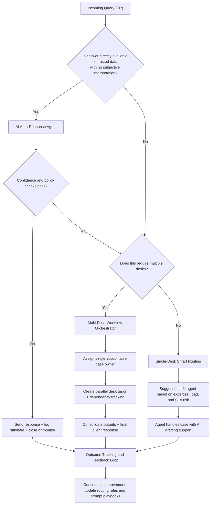

# Intelligent Query Handling Decision Tree

## Objective
Design a theoretical, high-impact triage logic for Hobart that:
- auto-resolves simple, objective requests,
- routes non-simple requests to the right human desk or workflow,
- reduces desk ping-pong and response latency.

## Visual Decision Tree



## Node Logic (Plain Language)

1. Data-Objective Gate
- Question: can the request be answered with factual system data only?
- If yes, AI can answer directly.
- If no, move to workflow routing.

2. AI Auto-Response Agent
- Handles repetitive, low-risk requests (status check, due date, known process step).
- Must pass confidence and policy checks before sending.
- If checks fail, fallback to workflow routing.

3. Multi-Desk Decision
- If resolution requires several desks, trigger orchestration, not serial handoffs.
- One case owner stays responsible end-to-end.

4. Single-Desk Smart Routing
- If one desk can solve it, suggest the most relevant available agent.
- Relevance should combine skill fit, active workload, and SLA pressure.

5. Feedback Loop
- Every handled case updates performance logs.
- Logs improve future routing, confidence thresholds, and prompt quality.

## Practical Rules (Theoretical Policy Layer)

```text
Rule 1: If objective data answer exists and confidence >= threshold, auto-respond.
Rule 2: If confidence < threshold, route to human workflow.
Rule 3: If more than one desk is required, orchestrate in parallel with one owner.
Rule 4: If one desk is required, route to best-fit non-overloaded agent.
Rule 5: Log all decisions for auditability and model improvement.
```

## Why This Stands Out in a Management Pitch
- It is not "AI replaces agents"; it is "AI protects agent time for complex work."
- It directly targets known friction points: looping, misrouting, and slow responses.
- It is actionable: each branch maps to a clear operating model and KPI ownership.
